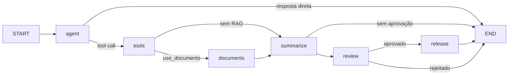

# langgraph-agent-lab

Criei este repositório para colocar em prática o que estou estudando sobre Python,
LLMs e arquiteturas de agentes de IA com LangGraph. A ideia é partir de um exemplo
pequeno, entender como cada parte funciona e evoluir o projeto conforme avanço nos estudos.

Este é um laboratório educacional que faz parte do meu portfólio de aprendizado.
**Não representa experiência profissional com LangGraph e não é um sistema utilizado
em produção.** Registro aqui o código, as decisões e as notas de estudo de cada etapa.

Meu objetivo é construir progressivamente um **Incident Investigation Agent** capaz de
receber uma solicitação como: “Investigue por que o pedido 123 apresentou inconsistência
e gere um relatório.”

Na **v0.1**, comecei com um único nó para acompanhar a passagem do estado pelo grafo.
Na **v0.2**, adicionei tool calling para consultar logs fictícios e resumir o resultado.
Na **v0.3**, adicionei roteamento condicional entre resposta direta e consulta. A **v0.4**
adicionou allowlist, validações, retries limitados, timeouts e um prazo total de execução,
além do contrato de ID para evitar investigações sem consulta e da resposta determinística
quando não há logs.

A **fase 5 (v0.5) está concluída**. Ela adiciona aprovação humana optativa na API do
grafo e na CLI, checkpoint em memória, revisão da síntese e retomada para aprovar ou
rejeitar um relatório simulado. A CLI persistente usa PostgreSQL com pgvector para
retomadas entre processos. Veja o [experimento completo](docs/human-in-the-loop.md).

No modo `ollama`, use `INCIDENT_LAB_REQUIRE_APPROVAL=true` para revisar o rascunho
no terminal. Digite `sim` para liberar o relatório simulado; outra resposta rejeita.
O tempo de leitura e decisão fica fora do orçamento de 300 segundos, compartilhado
pela investigação e pela retomada. A aprovação não grava nem publica arquivos.

`python -m app.persistent start` salva a investigação para revisão; `show` consulta e
`resume` aprova ou rejeita em outra execução do programa. `python -m app.documents`
prepara, ingere e consulta o catálogo documental local.
Veja a [preparação do banco e conexão pelo DBeaver](docs/postgres-local.md).
O pgvector está habilitado e a fase de RAG inclui ingestão, embeddings locais e busca
semântica. Consulte a [documentação do RAG](docs/rag.md) para o modelo das tabelas,
o pipeline e os limites atuais.

## O que é LangGraph

LangGraph é uma biblioteca de orquestração de workflows com estado. O fluxo é descrito
por nós (funções), arestas (transições) e um estado compartilhado. Nesta etapa, estou
estudando como o estado determina o próximo passo usando a Graph API. As referências estão na
[documentação oficial](https://docs.langchain.com/oss/python/langgraph/overview)
e as [notas de estudo](docs/study-notes.md).

## Arquitetura atual



`app/main.py` lê a configuração e invoca o grafo. `app/persistent.py` implementa a CLI
com checkpoints PostgreSQL e `app/documents.py` implementa a CLI de ingestão e busca.
`app/agents/state.py` define os dados; `nodes.py` valida a solicitação e produz a resposta;
`graph.py` conecta as etapas.
`app/core/config.py` concentra a leitura do ambiente e `app/core/model.py` configura
o modelo local. `tool_nodes.py` chama o modelo, escolhe a rota e sintetiza as evidências;
`app/tools/logs.py` contém `search_logs` e `app/tools/docs.py` integra o catálogo RAG.
`evals/` permanece reservado para a v0.6.

Sem falhas, na rota direta há uma chamada ao modelo e nenhuma ferramenta. Na rota de consulta há
duas chamadas ao modelo e uma à ferramenta. Com retries, são no máximo duas tentativas
na rota direta e quatro na rota de consulta; a ferramenta executa no máximo uma vez.
O modo `demo` mantém `START -> agent -> END`, sem usar LLM.

## Arquitetura planejada

Nas próximas etapas, pretendo adicionar avaliações de agentes e observabilidade, sem
avançar neste fechamento para a v0.6. `get_customer`, `search_docs` e `create_report`
continuam ideias futuras; não existem APIs ou regras de negócio para elas. Detalhei o
plano em
[architecture.md](docs/architecture.md).

## Como executar

Requisito: Python **3.12 ou 3.13** e pip. Em Linux/macOS, na raiz do repositório:

```bash
python3 -m venv .venv
source .venv/bin/activate
python -m pip install -e '.[dev]'
python -m app.main
```

Também é possível executar `incident-lab` após a instalação.
Uso `langgraph` para o fluxo e `langchain-ollama` para integrar o modelo local.
`langchain-core` fornece mensagens e tools; `pydantic` valida os argumentos da ferramenta.
Os dois últimos já eram dependências transitivas, mas agora são declarados porque o
código os importa diretamente. pytest, Ruff e mypy são ferramentas de desenvolvimento;
Hatchling é o backend de empacotamento.

Configuração opcional via variável de ambiente:

```bash
export INCIDENT_LAB_REQUEST="Investigue a inconsistência do pedido 456."
python -m app.main
```

Sem a variável, utiliza-se o exemplo do pedido 123. Um valor vazio encerra a CLI com
código 1 e mensagem em stderr. `.env.example` documenta a configuração, sem credenciais;
arquivos `.env` **não são carregados automaticamente**. Não há necessidade de API key.

No modo padrão `demo`, a saída informa: `nenhuma investigação foi realizada`.

### Executar tool calling com Ollama

Instale e inicie o [Ollama local](https://docs.ollama.com/quickstart). O pacote Python
instalado acima é apenas a integração: ele não instala o servidor nem baixa modelos.
Com o servidor disponível em `http://localhost:11434`, execute:

```bash
ollama pull qwen3:1.7b
export INCIDENT_LAB_MODE=ollama
export INCIDENT_LAB_MODEL=qwen3:1.7b
export INCIDENT_LAB_ORDER_ID=123
export INCIDENT_LAB_REQUEST="Investigue o pedido 123."
python -m app.main
```

Escolhi esse modelo pequeno como ponto de partida para experimentar localmente.
A qualidade do tool calling e a velocidade dependem do modelo e do hardware;
suporte a tools não garante que toda resposta siga o contrato.
A integração usa contexto de 4096 tokens e desativa o modo de raciocínio do Qwen3.
Referências: [modelo](https://ollama.com/library/qwen3:1.7b) e
[ChatOllama](https://docs.langchain.com/oss/python/integrations/chat/ollama).

`search_logs` aceita `order_id` como string de 1 a 12 dígitos. Somente `123` tem logs
fictícios: pagamento aprovado e falha simulada na atualização do pedido. Outros IDs
retornam uma lista vazia. Esses eventos são um exercício, não regras de negócio reais.

`INCIDENT_LAB_ORDER_ID` define o pedido da investigação (1 a 12 dígitos ASCII).
Quando configurado, o modelo deve consultar exatamente esse ID: resposta sem consulta
ou consulta a outro ID encerra com erro, sem relatório. Esse campo prevalece sobre
um ID divergente no texto; mantenha ambos consistentes. No uso programático, passe
`order_id` para `run_investigation` ou no estado de entrada do grafo.

Sem esse campo, permanece o tool calling experimental guiado pelo texto. Se o modelo
não chamar a ferramenta, a CLI apresenta uma orientação fixa de escopo e solicita
o ID estruturado; o texto livre do modelo não é exibido como investigação.
Uma ferramenta desconhecida, argumentos
inválidos, múltiplas chamadas, texto final vazio ou novas chamadas na síntese encerram
a execução com erro.
Após esgotar as tentativas, falhas de conexão e timeout encerram a CLI com código 1 e mensagem em stderr,
sem imprimir um relatório parcial. Inicie o servidor com `ollama serve` em outro
terminal e verifique se `ollama list` mostra o modelo configurado.
O primeiro incremento da v0.4 configura 5 segundos para conectar e 120 segundos
para leitura, escrita e espera por conexão disponível. O timeout de leitura limita
a espera entre blocos recebidos, não a duração total do grafo. Cada nó do modelo tem
no máximo duas tentativas para conexão recusada ou timeout, com intervalo de 0,5 segundo.
Falhas de validação não são repetidas; um retry da síntese reutiliza a evidência existente.
Além dos timeouts de rede, a CLI usa um prazo total de 300 segundos que inclui
ambos os nós do modelo, a ferramenta e a espera por retries. Ao expirar, cancela
a chamada assíncrona do cliente e encerra com código 1, sem relatório parcial.
Isso não garante que o servidor Ollama interrompa imediatamente a geração.
O prazo usa cancelamento cooperativo: código síncrono bloqueante em futuras
ferramentas exigirá outro controle. O uso direto de `build_graph().invoke/ainvoke`
não aplica esse prazo; para isso, use `run_investigation` em `app/core/execution.py`.
Falhas inesperadas continuam sendo propagadas para diagnóstico.
O HTTPX, já usado pela integração Ollama, é declarado como dependência direta porque
o aplicativo agora importa sua configuração de timeout e suas exceções.

Para experimentar a rota direta, com o modo `ollama` ativo:

```bash
unset INCIDENT_LAB_ORDER_ID
export INCIDENT_LAB_REQUEST="Investigue uma inconsistência."
python -m app.main
```

Sem ID configurado, a resposta sem ferramenta vira uma orientação fixa, mesmo que
o modelo alegue ter investigado. Outra experiência
é perguntar “O que você pode fazer?”. A rota depende da resposta efetiva do modelo,
não de palavras-chave na solicitação; esses exemplos não garantem o comportamento de
um LLM real. Um pedido de esclarecimento encerra esta execução: para informar o ID,
é preciso configurar `INCIDENT_LAB_ORDER_ID` e executar novamente, pois ainda não há conversa persistente.

Use apenas dados fictícios: a solicitação e as evidências são enviadas ao servidor
local e a síntese aparece no terminal. Para voltar ao exemplo inicial:
`export INCIDENT_LAB_MODE=demo`.

## Como testar e verificar qualidade

Com o ambiente virtual ativado:

```bash
python -m pytest
python -m ruff check .
python -m ruff format --check .
python -m mypy
```

Para formatar durante o desenvolvimento: `python -m ruff format .`.
Os testes cobrem o exemplo básico, as duas rotas e seu término, tool calling, validação,
ausência de logs, aprovação e retomada, persistência PostgreSQL, pgvector, ingestão e
busca semântica, falhas do modelo e comportamento das CLIs. Com PostgreSQL/pgvector
habilitado, a suíte completa atual passou com 152 testes. O modelo usa respostas
controladas; isso verifica a orquestração e as integrações locais, mas não comprova a
qualidade das respostas de um LLM real.

## Learning Goals

Quero usar este projeto para praticar e entender:

- Python moderno, tipagem e testes automatizados.
- StateGraph, estado, nós, arestas e workflows com estado.
- LLMs, tool calling e roteamento condicional.
- Guardrails, human-in-the-loop e avaliação de agentes.
- Observabilidade, segurança, custo e latência.

## Production Considerations

Mesmo sendo um laboratório, quero entender quais cuidados seriam necessários em
um sistema real. Ao longo das próximas versões, pretendo estudar:

- **Least privilege** e **tool allowlisting**: permissões mínimas e ferramentas autorizadas.
- **Input/output validation**: validação dos contratos de entrada e saída.
- **Execution limits**, **timeout** e **retry policies**: limites de execução, tempo e tentativas.
- **Human approval**: aprovação explícita antes de ações sensíveis.
- **Observability** e **evaluation**: rastreabilidade e medição da qualidade.
- **Latency**, **token usage** e **cost**: medição de latência, tokens e custo.
- **Prompt injection** e **segurança de tools**: entradas não confiáveis e proteção de integrações.

Já existe validação dos argumentos, apenas uma ferramenta registrada e no máximo uma
consulta por execução. Os demais controles são metas de estudo, não garantias já implementadas.

## Limitações

- Uma ferramenta com dados fictícios; sem integrações de negócio ou arquivo de relatório.
- Duas rotas, sem correção automática de argumentos ou loops.
- A decisão de consultar é do modelo; não há garantia de que ele escolha a rota adequada.
- A síntese pode conter erros do modelo; não há verificação semântica de suas afirmações.
- `app.main` usa checkpoint em memória; `app.persistent` usa PostgreSQL local,
  permitindo retomar a aprovação após encerrar o processo.
- Sem autenticação ou autorização de usuários; aprovação humana disponível na API local,
  na CLI em memória e na CLI persistente, sem efeitos externos ou tracing configurados.
  Há timeout de comunicação com o Ollama.
- Validação básica da solicitação e schema da tool; TypedDict não valida estado em runtime.
- Sem avaliações de qualidade de agentes, uso em produção ou métricas de tokens/custo.
- Dependências têm faixas de versão, sem lockfile; instalações futuras podem resolver
  versões diferentes. A compatibilidade precisa ser verificada a cada atualização.

## Roadmap

| Versão | Tema |
| --- | --- |
| v0.1 | Basic LangGraph — preservado no modo demo |
| v0.2 | Tool calling |
| v0.3 | Conditional routing — implementado |
| v0.4 | Guardrails and execution limits — concluída |
| v0.5 | Human-in-the-loop, PostgreSQL/pgvector e RAG local — concluída |
| v0.6 | Agent evaluations |
| v0.7 | Observability and tracing |
| v1.0 | Complete incident investigation agent |

Detalhes, critérios e limitações conhecidas estão em [roadmap.md](docs/roadmap.md),
[rag.md](docs/rag.md), [postgres-local.md](docs/postgres-local.md) e
[human-in-the-loop.md](docs/human-in-the-loop.md).
O histórico e a validação da correção estão em [validation-v0.4.md](docs/validation-v0.4.md).
Os conceitos estudados estão nas
[notas de estudo](docs/study-notes.md).

## Resposta quando não há logs

Quando `search_logs` retorna uma lista vazia, o nó `summarize` encerra com uma
resposta determinística, sem nova chamada ao modelo: não há registros para
determinar causa ou status, e ausência de logs não comprova inexistência do pedido.
A consulta continua sendo obrigatória para o ID configurado. Resultado ausente,
JSON inválido, campo `logs` inválido ou erro da ferramenta não viram sucesso.

Nesse caminho há uma chamada ao modelo para solicitar a consulta (até duas
tentativas com retry) e uma consulta à ferramenta. Com logs, a síntese continua
usando o modelo e mantém os riscos de interpretação já documentados.
