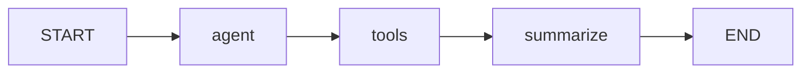

# langgraph-agent-lab

Criei este repositório para colocar em prática o que estou estudando sobre Python,
LLMs e arquiteturas de agentes de IA com LangGraph. A ideia é partir de um exemplo
pequeno, entender como cada parte funciona e evoluir o projeto conforme avanço nos estudos.

Este é um laboratório educacional que faz parte do meu portfólio de aprendizado.
**Não representa experiência profissional com LangGraph e não é um sistema utilizado
em produção.** Registro aqui o código, as decisões e as notas de estudo de cada etapa.

Meu objetivo é construir progressivamente um **Incident Investigation Agent** capaz de
receber uma solicitação como: “Investigue por que o pedido 123 apresentou inconsistência
e gere um relatório.”

Na **v0.1**, comecei com um único nó para acompanhar a passagem do estado pelo grafo.
Na **v0.2**, estou colocando tool calling em prática: um modelo local pode solicitar
logs fictícios de um pedido e resumir o resultado. Ainda não há investigação de dados
reais nem geração de arquivo de relatório. O exemplo inicial continua no modo `demo`.

## O que é LangGraph

LangGraph é uma biblioteca de orquestração de workflows com estado. O fluxo é descrito
por nós (funções), arestas (transições) e um estado compartilhado. Nesta etapa, estou
estudando como conectar o modelo a uma ferramenta usando a Graph API. As referências estão na
[documentação oficial](https://docs.langchain.com/oss/python/langgraph/overview)
e as [notas de estudo](docs/study-notes.md).

## Arquitetura atual



`app/main.py` lê a configuração e invoca o grafo. `app/agents/state.py` define os dados;
`nodes.py` valida a solicitação e produz a resposta; `graph.py` conecta as etapas.
`app/core/config.py` concentra a leitura do ambiente e `app/core/model.py` configura
o modelo local. `tool_nodes.py` solicita a ferramenta e sintetiza as evidências;
`app/tools/logs.py` contém `search_logs`. `evals/` permanece reservado para a v0.6.

O fluxo acima é fixo, com duas chamadas ao modelo e uma à ferramenta quando tudo dá
certo. O modo `demo` mantém `START -> agent -> END`, sem usar LLM.

## Arquitetura planejada

Nas próximas etapas, pretendo adicionar `get_customer`, `search_docs` e `create_report`
e evoluir a consulta de logs. Também quero explorar roteamento condicional, limites,
aprovação humana, avaliações e rastreamento. Os contratos e as integrações ainda serão
definidos conforme eu desenvolver cada etapa. Detalhei esse plano em
[architecture.md](docs/architecture.md).

## Como executar

Requisito: Python **3.12+** e pip. Em Linux/macOS, na raiz do repositório:

```bash
python3 -m venv .venv
source .venv/bin/activate
python -m pip install -e '.[dev]'
python -m app.main
```

Também é possível executar `incident-lab` após a instalação.
Uso `langgraph` para o fluxo e `langchain-ollama` para integrar o modelo local.
`langchain-core` fornece mensagens e tools; `pydantic` valida os argumentos da ferramenta.
Os dois últimos já eram dependências transitivas, mas agora são declarados porque o
código os importa diretamente. pytest, Ruff e mypy são ferramentas de desenvolvimento;
Hatchling é o backend de empacotamento.

Configuração opcional via variável de ambiente:

```bash
export INCIDENT_LAB_REQUEST="Investigue a inconsistência do pedido 456."
python -m app.main
```

Sem a variável, utiliza-se o exemplo do pedido 123. Um valor vazio encerra a CLI com
código 1 e mensagem em stderr. `.env.example` documenta a configuração, sem credenciais;
arquivos `.env` **não são carregados automaticamente**. Não há necessidade de API key.

No modo padrão `demo`, a saída informa: `nenhuma investigação foi realizada`.

### Executar tool calling com Ollama

Instale e inicie o [Ollama local](https://docs.ollama.com/quickstart). O pacote Python
instalado acima é apenas a integração: ele não instala o servidor nem baixa modelos.
Com o servidor disponível em `http://localhost:11434`, execute:

```bash
ollama pull qwen3:1.7b
export INCIDENT_LAB_MODE=ollama
export INCIDENT_LAB_MODEL=qwen3:1.7b
export INCIDENT_LAB_REQUEST="Investigue o pedido 123."
python -m app.main
```

Escolhi esse modelo pequeno como ponto de partida para experimentar localmente.
A qualidade do tool calling e a velocidade dependem do modelo e do hardware;
suporte a tools não garante que toda resposta siga o contrato.
A integração usa contexto de 4096 tokens e desativa o modo de raciocínio do Qwen3.
Referências: [modelo](https://ollama.com/library/qwen3:1.7b) e
[ChatOllama](https://docs.langchain.com/oss/python/integrations/chat/ollama).

`search_logs` aceita `order_id` como string de 1 a 12 dígitos. Somente `123` tem logs
fictícios: pagamento aprovado e falha simulada na atualização do pedido. Outros IDs
retornam uma lista vazia. Esses eventos são um exercício, não regras de negócio reais.

O modelo deve solicitar exatamente uma consulta. Uma resposta sem tool call, com
ferramenta desconhecida, argumentos inválidos ou novas chamadas na síntese encerra a
execução com erro. Aprenderei a lidar com rotas alternativas na v0.3.
Falhas de conexão e execução inesperadas são propagadas para diagnóstico; verifique
se o servidor está iniciado e se `ollama list` mostra o modelo configurado.

Use apenas dados fictícios: a solicitação e as evidências são enviadas ao servidor
local e a síntese aparece no terminal. Para voltar ao exemplo inicial:
`export INCIDENT_LAB_MODE=demo`.

## Como testar e verificar qualidade

Com o ambiente virtual ativado:

```bash
python -m pytest
python -m ruff check .
python -m ruff format --check .
python -m mypy
```

Para formatar durante o desenvolvimento: `python -m ruff format .`.
Os testes cobrem o exemplo básico, o ciclo de tool calling, validação, ausência de logs,
falhas do modelo e comportamento da CLI. O modelo é substituído por respostas controladas;
o grafo e a ferramenta executam de verdade, sem rede. Isso verifica a orquestração,
mas não comprova a qualidade das respostas de um LLM real.

## Learning Goals

Quero usar este projeto para praticar e entender:

- Python moderno, tipagem e testes automatizados.
- StateGraph, estado, nós, arestas e workflows com estado.
- LLMs e tool calling; roteamento condicional na próxima etapa.
- Guardrails, human-in-the-loop e avaliação de agentes.
- Observabilidade, segurança, custo e latência.

## Production Considerations

Mesmo sendo um laboratório, quero entender quais cuidados seriam necessários em
um sistema real. Ao longo das próximas versões, pretendo estudar:

- **Least privilege** e **tool allowlisting**: permissões mínimas e ferramentas autorizadas.
- **Input/output validation**: validação dos contratos de entrada e saída.
- **Execution limits**, **timeout** e **retry policies**: limites de execução, tempo e tentativas.
- **Human approval**: aprovação explícita antes de ações sensíveis.
- **Observability** e **evaluation**: rastreabilidade e medição da qualidade.
- **Latency**, **token usage** e **cost**: medição de latência, tokens e custo.
- **Prompt injection** e **segurança de tools**: entradas não confiáveis e proteção de integrações.

Já existe validação dos argumentos e apenas uma ferramenta registrada nesta rodada
fixa. Os demais controles são metas de estudo, não garantias já implementadas.

## Limitações

- Uma ferramenta com dados fictícios; sem integrações de negócio ou arquivo de relatório.
- Fluxo fixo, sem rotas alternativas, correção automática de argumentos ou loops.
- A síntese pode conter erros do modelo; não há verificação semântica de suas afirmações.
- Estado somente na invocação; sem persistência, memória entre execuções ou checkpoint.
- Sem autenticação, autorização, retry, timeout, aprovação humana ou tracing configurados.
- Validação básica da solicitação e schema da tool; TypedDict não valida estado em runtime.
- Sem avaliações de qualidade de agentes, uso em produção ou métricas de tokens/custo.
- Dependências têm faixas de versão, sem lockfile; instalações futuras podem resolver
  versões diferentes. A compatibilidade precisa ser verificada a cada atualização.

## Roadmap

| Versão | Tema |
| --- | --- |
| v0.1 | Basic LangGraph — preservado no modo demo |
| v0.2 | Tool calling — fase atual |
| v0.3 | Conditional routing |
| v0.4 | Guardrails and execution limits |
| v0.5 | Human-in-the-loop |
| v0.6 | Agent evaluations |
| v0.7 | Observability and tracing |
| v1.0 | Complete incident investigation agent |

Detalhes e critérios de conclusão em [roadmap.md](docs/roadmap.md).
Antes de avançar para a v0.3, vou experimentar o modelo local e revisar os conceitos nas
[notas de estudo](docs/study-notes.md).
