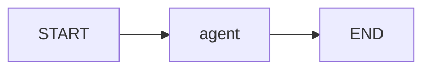

# langgraph-agent-lab

Criei este repositório para colocar em prática o que estou estudando sobre Python,
LLMs e arquiteturas de agentes de IA com LangGraph. A ideia é partir de um exemplo
pequeno, entender como cada parte funciona e evoluir o projeto conforme avanço nos estudos.

Este é um laboratório educacional que faz parte do meu portfólio de aprendizado.
**Não representa experiência profissional com LangGraph e não é um sistema utilizado
em produção.** Registro aqui o código, as decisões e as notas de estudo de cada etapa.

Meu objetivo é construir progressivamente um **Incident Investigation Agent** capaz de
receber uma solicitação como: “Investigue por que o pedido 123 apresentou inconsistência
e gere um relatório.”

Na **v0.1**, comecei pelo básico: montar um grafo com um único nó e acompanhar como o
estado passa por ele. A resposta é fixa em sua estrutura, sem chamada a um LLM.
Nenhuma investigação, consulta de dados ou geração de relatório acontece ainda.

## O que é LangGraph

LangGraph é uma biblioteca de orquestração de workflows com estado. O fluxo é descrito
por nós (funções), arestas (transições) e um estado compartilhado. Nesta etapa, estou
estudando sua Graph API antes de integrar um modelo. As referências estão na
[documentação oficial](https://docs.langchain.com/oss/python/langgraph/overview)
e as [notas de estudo](docs/study-notes.md).

## Arquitetura atual



`app/main.py` lê a configuração e invoca o grafo. `app/agents/state.py` define os dados;
`nodes.py` valida a solicitação e produz a resposta; `graph.py` conecta as etapas.
`app/core/config.py` concentra a leitura do ambiente. `app/tools/` e `evals/` reservam
espaço para fases futuras, sem implementações antecipadas.

## Arquitetura planejada

Nas próximas etapas, pretendo adicionar ferramentas como `search_logs`, `get_customer`,
`search_docs` e `create_report`. Também quero explorar roteamento condicional, limites,
aprovação humana, avaliações e rastreamento. Os contratos e as integrações ainda serão
definidos conforme eu desenvolver cada etapa. Detalhei esse plano em
[architecture.md](docs/architecture.md).

## Como executar

Requisito: Python **3.12+** e pip. Em Linux/macOS, na raiz do repositório:

```bash
python3 -m venv .venv
source .venv/bin/activate
python -m pip install -e '.[dev]'
python -m app.main
```

Também é possível executar `incident-lab` após a instalação.
O único pacote de execução declarado diretamente é `langgraph`; pytest, Ruff e mypy
são dependências de desenvolvimento. Hatchling é o backend de empacotamento.

Configuração opcional via variável de ambiente:

```bash
export INCIDENT_LAB_REQUEST="Investigue a inconsistência do pedido 456."
python -m app.main
```

Sem a variável, utiliza-se o exemplo do pedido 123. Um valor vazio encerra a CLI com
código 1 e mensagem em stderr. `.env.example` documenta a configuração, sem credenciais;
arquivos `.env` **não são carregados automaticamente**. Não há necessidade de API key.

A saída confirma a solicitação e informa: `nenhuma investigação foi realizada`.
Use apenas dados fictícios: a CLI imprime a solicitação no terminal.

## Como testar e verificar qualidade

Com o ambiente virtual ativado:

```bash
python -m pytest
python -m ruff check .
python -m ruff format --check .
python -m mypy
```

Para formatar durante o desenvolvimento: `python -m ruff format .`.
Os testes cobrem execução do grafo, entrada inválida, atualização sem mutação,
isolamento entre invocações e comportamento da CLI/configuração. Não precisam de rede.

## Learning Goals

Quero usar este projeto para praticar e entender:

- Python moderno, tipagem e testes automatizados.
- StateGraph, estado, nós, arestas e workflows com estado.
- LLMs, tool calling e roteamento condicional nas próximas etapas.
- Guardrails, human-in-the-loop e avaliação de agentes.
- Observabilidade, segurança, custo e latência.

## Production Considerations

Mesmo sendo um laboratório, quero entender quais cuidados seriam necessários em
um sistema real. Ao longo das próximas versões, pretendo estudar:

- **Least privilege** e **tool allowlisting**: permissões mínimas e ferramentas autorizadas.
- **Input/output validation**: validação dos contratos de entrada e saída.
- **Execution limits**, **timeout** e **retry policies**: limites de execução, tempo e tentativas.
- **Human approval**: aprovação explícita antes de ações sensíveis.
- **Observability** e **evaluation**: rastreabilidade e medição da qualidade.
- **Latency**, **token usage** e **cost**: medição de latência, tokens e custo.
- **Prompt injection** e **segurança de tools**: entradas não confiáveis e proteção de integrações.

Esses controles são metas de estudo, não garantias já implementadas.

## Limitações

- Nó determinístico, sem LLM, ferramentas, relatórios ou dados reais.
- Estado somente na invocação; sem persistência, memória entre execuções ou checkpoint.
- Sem autenticação, autorização, retry, timeout, aprovação humana ou tracing configurados.
- Validação básica da solicitação; TypedDict não é validação em runtime.
- Sem avaliações de qualidade de agentes, uso em produção ou métricas de tokens/custo.
- Dependências têm faixas de versão, sem lockfile; instalações futuras podem resolver
  versões diferentes. A compatibilidade precisa ser verificada a cada atualização.

## Roadmap

| Versão | Tema |
| --- | --- |
| v0.1 | Basic LangGraph — fase atual |
| v0.2 | Tool calling |
| v0.3 | Conditional routing |
| v0.4 | Guardrails and execution limits |
| v0.5 | Human-in-the-loop |
| v0.6 | Agent evaluations |
| v0.7 | Observability and tracing |
| v1.0 | Complete incident investigation agent |

Detalhes e critérios de conclusão em [roadmap.md](docs/roadmap.md).
Antes de avançar para a v0.2, vou revisar esta base e os conceitos registrados nas
[notas de estudo](docs/study-notes.md).
